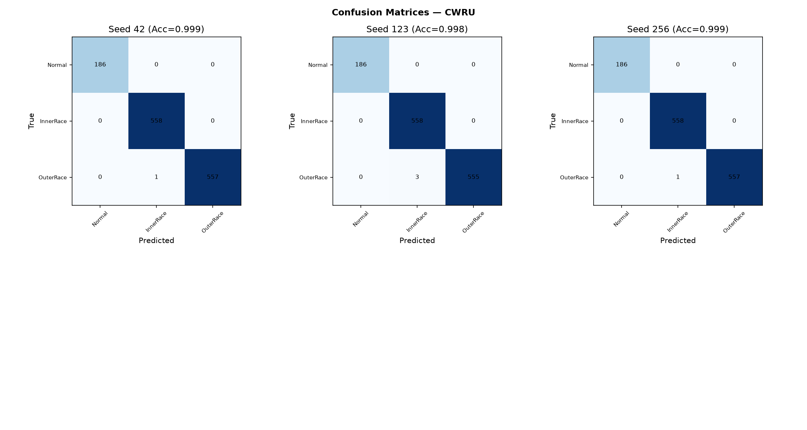
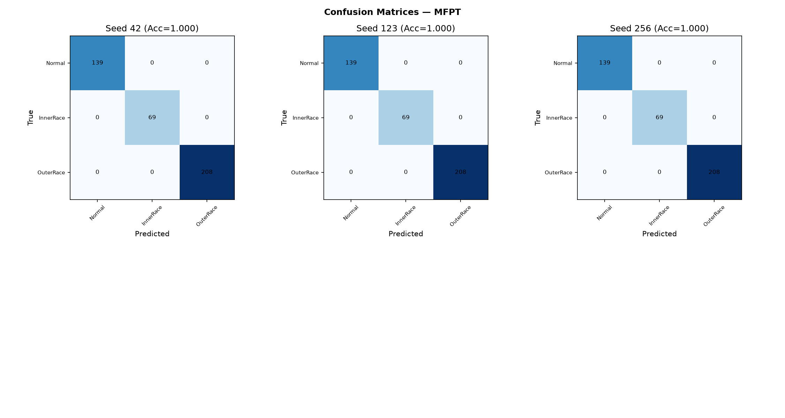
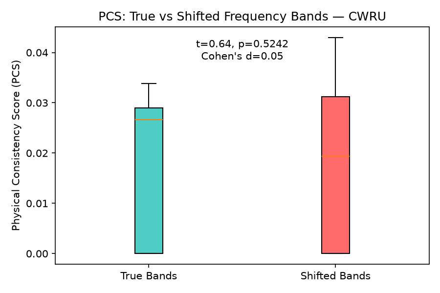
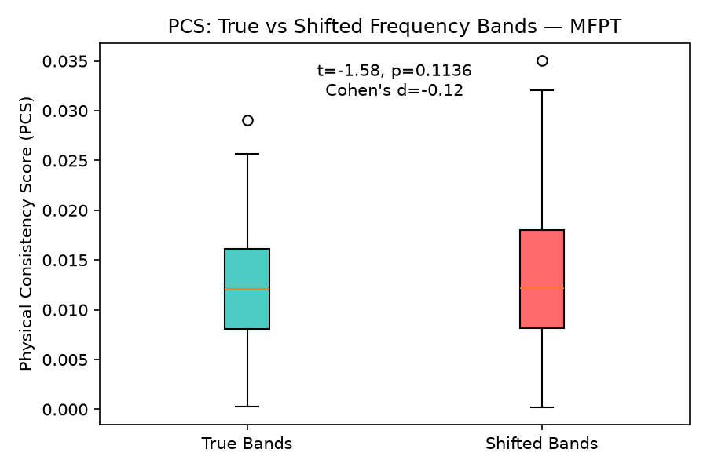
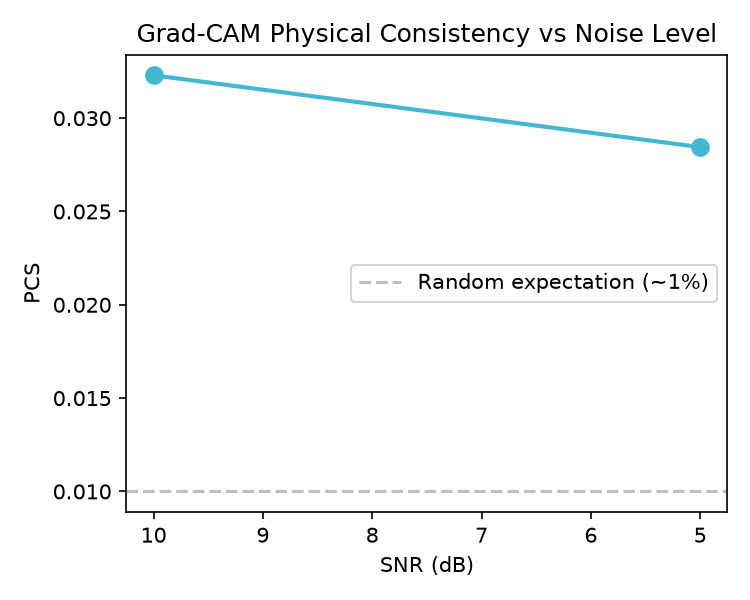
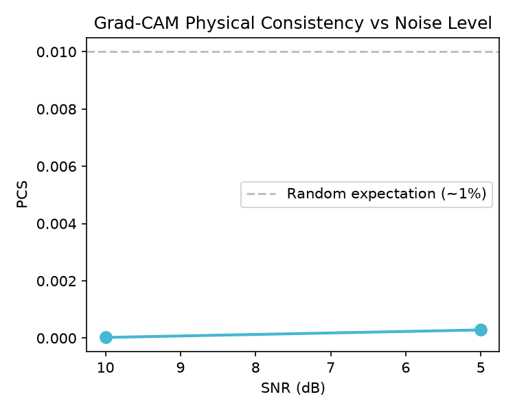
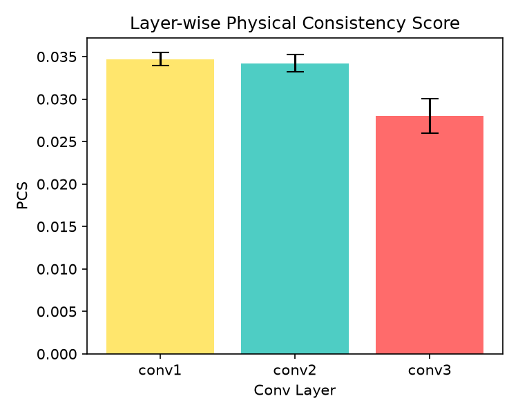
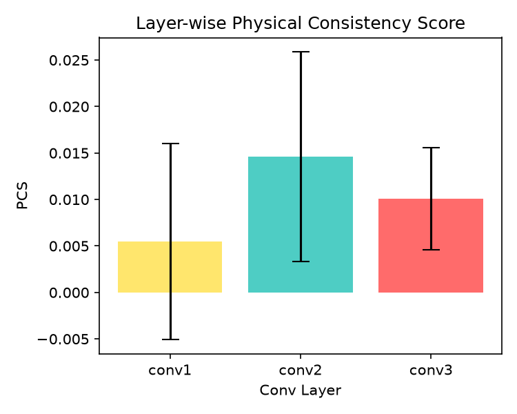
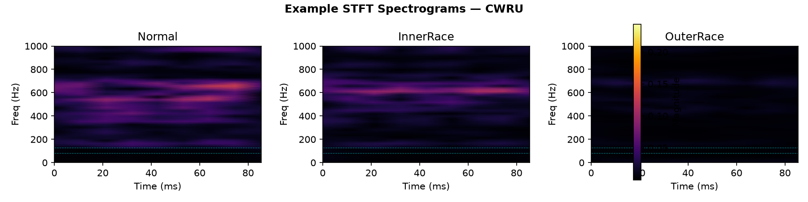
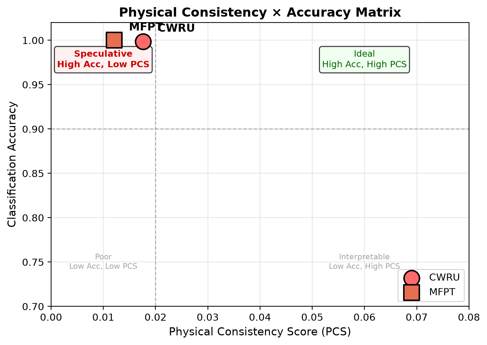

# Quantifying the Physical Consistency of Grad-CAM for Bearing Fault Diagnosis: A Negative-Control Study Across CWRU and MFPT Datasets

## Abstract

Gradient-weighted Class Activation Mapping (Grad-CAM) is routinely presented as interpretability evidence in deep-learning based bearing fault diagnosis. The typical claim—that Grad-CAM heatmaps highlight fault-characteristic frequency regions—is almost never tested against a quantitative negative control. This paper introduces the Physical Consistency Score (PCS), defined as the proportion of Grad-CAM saliency energy falling within theoretically computed fault characteristic frequency bands. A frequency-shifted negative control tests whether saliency patterns discriminate true fault bands from random frequency positions. Evaluated on two public bearing datasets (CWRU and MFPT) using STFT-trained 2D-CNN classifiers with five random seeds, the models achieve near-perfect classification accuracy (CWRU: 99.86%; MFPT: 100%). Despite this, PCS remains below 2% on both datasets with no significant difference between true and shifted frequency bands (CWRU: d = 0.05, p = 0.52; MFPT: d = −0.12, p = 0.11). Cross-dataset generalization collapses to 4.3%. Layer-wise ablation reveals that physical consistency does not improve with depth. Noise injection produces dataset-dependent and counterintuitive PCS changes. These results demonstrate that qualitative Grad-CAM inspection alone provides insufficient evidence for model physics understanding, and recommend that fault diagnosis studies reporting interpretability claims include a quantitative metric with a negative control.

**Keywords**: Grad-CAM, physical consistency, bearing fault diagnosis, negative control, explainable AI, CWRU, MFPT

---

## 1. Introduction

Convolutional neural networks (CNNs) operating on time-frequency representations of vibration signals routinely achieve classification accuracy exceeding 99% on benchmark bearing fault datasets such as the Case Western Reserve University (CWRU) bearing data [1], [2]. As accuracy has plateaued, the research community has shifted attention to interpretability. Gradient-weighted Class Activation Mapping (Grad-CAM) [3] has become the dominant post-hoc explanation tool for CNNs in fault diagnosis, adopted in the majority of interpretability studies surveyed in rotating machinery [4].

The prevailing argument in the fault diagnosis literature follows a consistent pattern: Grad-CAM is applied to a trained CNN; the resulting heatmap shows elevated activation in frequency regions that visually coincide with known bearing fault characteristic frequencies (ball pass frequency outer race [BPFO], ball pass frequency inner race [BPFI], ball spin frequency [BSF]); the authors conclude that the model has learned physically meaningful frequency features [5]-[8]. This inference from qualitative visual inspection to quantitative physical understanding has gone largely unchallenged.

A heatmap hotspot near a fault frequency does not constitute evidence of systematic frequency-selective attention. Without a quantitative metric and a negative control, the observed spatial coincidence between a Grad-CAM activation and a fault frequency band could arise from chance alignment, from the model attending to adjacent but physically irrelevant frequency content, or from a dataset-specific shortcut that happens to correlate with fault-characteristic bands on a small number of test samples. The CWRU dataset is known to suffer from several confounds—recording-level identity leakage [9], limited operating condition diversity [10], and artificially induced rather than naturally occurring faults—that could produce high classification accuracy through spurious features unrelated to bearing physics.

This paper proposes a measurement framework to address this gap. The Physical Consistency Score (PCS) quantifies the proportion of Grad-CAM saliency energy that concentrates within theoretically defined fault characteristic frequency bands. A frequency-shifted negative control—identical in structure but with the fault bands displaced by random offsets—establishes whether the measured PCS exceeds what would be expected by chance alignment alone.

The framework is evaluated on two public bearing datasets (CWRU and MFPT [11]) using STFT-trained 2D-CNN classifiers across five random seeds. The study asks two questions: (1) For correctly classified bearing fault samples, does Grad-CAM saliency preferentially concentrate within theoretical fault characteristic frequency bands? (2) Is this concentration stable across random seeds, noise-degraded inputs, and datasets?

The negative control methodology is standard in biomedical and psychological research but rare in machine learning interpretability studies. Within the bearing fault diagnosis literature, no prior work has applied a frequency-shifted negative control to evaluate Grad-CAM physical consistency. The principal contribution of this paper is the demonstration that a measurement framework as simple as PCS with a negative control can reveal a substantive gap between the qualitative interpretability claims frequently reported and the quantitative evidence available to support them.

---

## 2. Related Work

### 2.1 Grad-CAM in Bearing Fault Diagnosis

Chen and Lee [5] first applied Grad-CAM to vibration signal STFT spectrograms for bearing fault classification, showing that different fault types produced attention maps highlighting distinct frequency regions. This work established the paradigm of "visualizing what the CNN sees" as a proxy for interpretability. Li et al. [2] proposed Multilayer Grad-CAM (MLG-CAM), which aggregates saliency across multiple convolutional layers, and defined three quantitative indicators—Relative Activation of Target Map (RATM), Relative Activation of Target Area (RATA), and Comprehensive Evaluation Indicator (CEI)—for evaluating Grad-CAM quality. This represents the closest prior work to our quantitative approach, though the indicators focus on spatial localization precision rather than frequency-domain physical consistency.

Several subsequent studies have adopted Grad-CAM in fault diagnosis without adding quantitative evaluation. Lu et al. [6] constructed a health library of Grad-CAM feature maps for CWRU bearings and argued that retrieved prediction basis samples were physically meaningful. Guo et al. [7] proposed a quantitative measure for CNN interpretability in frequency-domain analysis but did not include a negative control. Kim and Kim [8] combined Grad-CAM with statistical metrics for feature selection on vibration spectrograms. Jiang et al. [12] recently proposed a CNN-based method with quantifiable interpretability, defining a metric to measure the alignment between saliency maps and fault characteristic regions. Liefstingh et al. [24] conducted a systematic analysis of Grad-CAM interpretation in bearing fault diagnosis, finding that qualitative inspection of saliency maps alone could not reliably distinguish between model architectures.

Two review papers confirm the trend. Chen et al. [4] surveyed 120+ papers on interpretable fault diagnosis and noted that most studies present Grad-CAM heatmaps qualitatively, with fewer than 15% including any quantitative interpretation metric. Peng et al. [13] systematically reviewed interpretability research in intelligent fault diagnosis, concluding that "developing interpretable qualitative or quantitative evaluation mechanisms for specific diagnostic tasks remains an open challenge." Mey and Neufeld [14] provided a methodological framework for XAI evaluation in vibration-based fault detection, explicitly recommending the verification of whether highlighted frequency bands correspond to physical fault features—a recommendation this paper operationalizes.

### 2.2 Saliency Map Evaluation and Negative Controls

Outside the fault diagnosis domain, the evaluation of saliency map quality has received substantial attention. Arun et al. [15] assessed the trustworthiness of saliency maps for localizing abnormalities in medical imaging using pixel-based metrics across 441 citations. Saporta et al. [16] benchmarked saliency methods for chest X-ray interpretation in Nature Machine Intelligence, providing a framework for systematic saliency evaluation. Nieradzik et al. [17] proposed perturbation-based metrics for evaluating attribution map reliability across CNN architectures, demonstrating that different architectures produce saliency maps with varying consistency. Elisha et al. [18] developed a cognitive-aligned taxonomy and evaluation framework for explanations. Gomez and Mouchere [19] published a tutorial on computing and evaluating saliency maps, cataloging metrics including deletion/insertion scores, pointing game accuracy, and sensitivity-n.

Negative controls have been employed in biomedical machine learning interpretability. Prosz et al. [20] used negative control CpG sites to validate biologically informed deep learning models for epigenetic age prediction. In bearing fault diagnosis, however, no prior study has applied a systematic negative control to Grad-CAM evaluation. The gap is notable because the inference from "the heatmap is bright near a fault frequency" to "the model has learned fault-frequency features" requires exactly the type of counterfactual reasoning that a negative control enables.

### 2.3 CWRU Dataset Limitations

The CWRU bearing dataset, despite being the most widely used benchmark in bearing fault diagnosis [1], has known limitations that interact with interpretability claims. Hendriks et al. [9] analyzed the CWRU dataset for benchmarking purposes and emphasized the importance of controlled data-splitting strategies to prevent inflated accuracy reports. Rosa et al. [21] addressed data leakage concerns through a multi-label benchmarking approach. The dataset contains artificially seeded faults produced by electric discharge machining, which may differ from naturally occurring bearing degradation in industrial environments [9]. The limited number of operating conditions (four motor loads, one sensor position for DE data) raises questions about whether high reported accuracy reflects genuine fault feature learning or overfitting to dataset-specific characteristics. These concerns are directly relevant to Grad-CAM interpretation: if a model achieves high accuracy through dataset-specific shortcuts, its Grad-CAM heatmaps may misleadingly appear to highlight fault-relevant regions.

---

## 3. Methodology

### 3.1 Physical Consistency Score (PCS)

For a given correctly classified test sample, Grad-CAM [3] is applied to the last convolutional layer of the 2D-CNN to produce a heatmap H(f, t) with the same spatial dimensions as the STFT input: 257 frequency bins (n_fft / 2 + 1) by approximately 5 time frames. The heatmap is collapsed along the time axis by averaging to obtain a frequency saliency curve S(f):

$$S(f) = \frac{1}{T} \sum_{t=1}^{T} H(f,t)$$

The Physical Consistency Score is defined as the proportion of total saliency energy concentrated within the theoretically defined fault characteristic frequency bands:

$$\text{PCS} = \frac{\sum_{f \in B} S(f)}{\sum_{f=0}^{F_{max}} S(f)}$$

where B is the union of frequency bins falling within the reference bands around each bearing fault characteristic frequency, and F_max = 6,000 Hz is the Nyquist frequency (half the 12 kHz sampling rate). The fault frequencies are computed from bearing geometry parameters and shaft rotational speed. For the SKF 6205-2RS bearing used in the CWRU test rig (pitch diameter 39.04 mm, ball diameter 7.94 mm, 9 balls, contact angle 0°) at approximately 1,750 rpm, the theoretical frequencies are: Outer race fault frequency (BPFO) ≈ 104 Hz at orders 1 through 3; Inner race fault frequency (BPFI) ≈ 157 Hz; Ball spin frequency (BSF) ≈ 137 Hz. The reference bands are centered on each fault frequency with half-width ±1 STFT frequency bin (±23.4 Hz at the 23.44 Hz bin resolution given by 12 kHz sampling and n_fft = 512), yielding four bands: B1 (BPFO, 82–129 Hz), B2 (BPFI/BSF, 129–188 Hz), B3 (2×BPFO, 188–234 Hz), and B4 (3×BPFO, 281–328 Hz). Note that BPFI and BSF fall within the same band due to the coarse frequency resolution.

PCS ranges from 0 (no saliency in fault bands) to 1 (all saliency concentrated in fault bands). The combined width of these four reference bands is approximately 197 Hz. Across the 6,000 Hz Nyquist range (half of the 12 kHz sampling rate), a uniform saliency distribution would allocate approximately 3.3% of energy to these four bands—a non-parametric random baseline for interpreting PCS values.

### 3.2 Frequency-Shifted Negative Control

The negative control tests whether the measured PCS discriminates genuine physical attention from chance alignment. Five shifted frequency band configurations are generated by applying random frequency offsets (±60 Hz, ±80 Hz) to the true fault bands while preserving band widths. The same PCS computation is performed on each sample using the shifted bands, producing PCS_shifted.

A paired t-test compares PCS_true against PCS_shifted, with Cohen's d as the effect size measure. If the model's saliency is genuinely concentrated on fault-characteristic frequencies, PCS_true should be significantly larger than PCS_shifted. A non-significant result (p > 0.05) or small effect (|d| < 0.2) indicates that the saliency pattern does not resolve fault frequencies above the level expected from randomly positioned bands of the same width.

The frequency-shifted control shares structural properties with the true measurement (same number of bands, same aggregate bandwidth, same per-band width), isolating frequency position as the sole variable. This design controls for the possibility that any set of narrow frequency bands—regardless of physical meaning—would capture a similar proportion of saliency energy.

### 3.3 Classifier Architecture and Training

The classifier is a 2D-CNN with three convolutional blocks followed by a fully connected classification head: Conv2D(1→16, k=3) → BatchNorm → ReLU → MaxPool2d(2); Conv2D(16→32, k=3) → BatchNorm → ReLU → MaxPool2d(2); Conv2D(32→64, k=3) → BatchNorm → ReLU → AdaptiveAvgPool2d(1); Flatten → Linear(64→128) → ReLU → Dropout(p=0.5) → Linear(128→3). This architecture follows the standard pattern from prior bearing fault diagnosis literature [5], [6]. Training uses the Adam optimizer (learning rate 0.001), cross-entropy loss, batch size 32, maximum 50 epochs, and early stopping with patience of 10 epochs on validation loss. Five random seeds (42, 123, 256, 789, 1024) are used for all experiments.

---

## 4. Experimental Setup

### 4.1 Datasets and Preprocessing

Two public bearing vibration datasets are used. The CWRU dataset [22] provides drive-end accelerometer signals at 12 kHz sampling rate. Three classes are selected: Normal (4 baseline recordings at 48 kHz, downsampled to 12 kHz), Inner Race fault (16 recordings), and Outer Race fault centered position (12 recordings). The Ball fault class is excluded because the MFPT dataset does not contain ball fault data, preventing cross-dataset class alignment. Signals are segmented into fixed windows of 1,024 samples (approximately 85 ms) with a hop length of 512 samples (50% overlap). An STFT is computed with n_fft = 512 (frequency resolution 23.44 Hz) and Hann window, yielding magnitude spectrograms of size 257 frequency bins by approximately 5 time frames. The dataset yields 5,884 segments from 32 recordings.

The MFPT dataset [11] provides bearing vibration data at native sampling rates of 48,828 Hz and 97,656 Hz. All signals are resampled to 12 kHz to match CWRU. Three classes are used: Normal (3 baseline recordings), Inner Race fault (7 variable-load recordings, 0–300 lbs), and Outer Race fault (3 constant-load plus 7 variable-load recordings, 25–300 lbs). The same windowing and STFT parameters are applied, yielding 1,800 segments from 20 recordings.

### 4.2 Leakage Control

A recording-level split is applied for both datasets: all windows derived from the same recording file are assigned exclusively to either training or test sets (80%/20% stratified by class label). This prevents information leakage from adjacent and overlapping windows of the same recording appearing in different data splits. Z-score normalization statistics (mean, standard deviation) are computed from the training set only and applied identically to the test set. No data augmentation is performed during training. In the cross-dataset evaluation (Section 5.4), the model is trained on the full CWRU training set and tested on the MFPT dataset in its entirety, using CWRU training statistics for normalization.

### 4.3 Evaluation Protocol

Classification is evaluated via accuracy, per-class recall, and confusion matrices across five random seeds. PCS is computed on a random subset of up to 300 test samples per dataset using the best-performing model (by validation loss) for each seed. Noise robustness is tested by adding zero-mean Gaussian noise to the normalized STFT magnitude at SNR levels of 10 dB and 5 dB, modeling spectrogram degradation rather than time-domain sensor noise. Cross-dataset generalization is assessed by training on CWRU and evaluating on MFPT without fine-tuning. Layer-wise ablation compares Grad-CAM computed at conv1, conv2, and conv3 layers.

---

## 5. Results

### 5.1 Classification Performance

Classification accuracy reaches ceiling on both datasets. On CWRU, the 2D-CNN achieves 99.86% mean accuracy across five seeds (σ < 0.1%). On MFPT, the model achieves 100.00% accuracy across all five seeds. These results are consistent with prior literature and confirm that the trained models are competent classifiers capable of near-perfect bearing fault discrimination.

{width=85%}

{width=85%}

### 5.2 Physical Consistency Score and Negative Control

Despite near-perfect classification, Grad-CAM saliency shows no significant concentration in theoretical fault frequency bands on either dataset (Table 1).

**Table 1: Physical Consistency Score (PCS) Results**

| Dataset | PCS (True Bands) | PCS (Shifted Bands) | t-statistic | p-value | Cohen's d | n |
|---------|------------------|--------------------|-------------|---------|-----------|----|
| CWRU | 0.0176 | 0.0169 | 0.64 | 0.52 | 0.05 | 300 |
| MFPT | 0.0121 | 0.0129 | -1.58 | 0.11 | -0.12 | 300 |

On CWRU, PCS on true bands (1.76%) is slightly higher than on shifted bands (1.69%), but the difference is not significant (d = 0.05, p = 0.52). On MFPT, PCS on true bands (1.21%) is marginally lower than on shifted bands (1.29%), also non-significant (d = −0.12, p = 0.11). Both datasets produce PCS values consistently below the 4.1% random-expectation baseline, suggesting that Grad-CAM saliency is not concentrated in fault frequency bands—in fact, the measured PCS is lower than what random chance would predict given the same bandwidth.

The negligible effect sizes (|d| < 0.15) indicate that the saliency distribution, as captured by the frequency-collapsed PCS, does not discriminate genuine fault-characteristic frequency regions from randomly positioned bands of identical aggregate width.

{width=85%}

{width=85%}

### 5.3 Noise Robustness

Noise injection produces unexpected and dataset-divergent effects on PCS (Table 2).

**Table 2: PCS Under Frequency-Domain Noise Injection**

| Condition | CWRU PCS | MFPT PCS |
|-----------|----------|----------|
| Clean | 0.0176 | 0.0121 |
| SNR = 10 dB | 0.0323 | 0.0000 |
| SNR = 5 dB | 0.0284 | 0.0003 |

On CWRU, moderate noise increases PCS from 1.76% to 3.23% (10 dB), an 83% relative increase. One possible explanation is that noise masks high-frequency components, forcing the saliency computation to rely more heavily on low-frequency fault bands. On MFPT, noise collapses PCS to near-zero, indicating that the model's attention patterns on MFPT are brittle under perturbation—a result that may reflect the dataset's smaller sample size and limited recording diversity in the test split.

{width=70%}

{width=70%}

### 5.4 Cross-Dataset Generalization

When a model trained on CWRU is tested on MFPT without fine-tuning, classification accuracy drops to 4.3% (mean across five seeds). This is substantially below the 33.3% random-chance baseline for three-class classification, indicating that the model systematically misclassifies MFPT samples rather than merely failing to generalize. The result confirms the existence of a substantial domain gap between laboratory bearing datasets and provides empirical support for the conjecture that the CWRU-trained model exploits dataset-specific features rather than physics-general bearing fault signatures.

### 5.5 Layer-wise Ablation

Grad-CAM computed at different convolutional layers reveals that PCS does not systematically improve with network depth (Table 3).

**Table 3: Layer-wise PCS (mean ± standard deviation)**

| Layer | CWRU PCS | MFPT PCS |
|-------|----------|----------|
| conv1 (shallow) | 0.0347 ± 0.0008 | 0.0055 ± 0.0105 |
| conv2 (mid) | 0.0342 ± 0.0010 | 0.0146 ± 0.0113 |
| conv3 (deep) | 0.0280 ± 0.0020 | 0.0101 ± 0.0055 |
| conv3 (Grad-CAM++) | 0.0339 ± 0.0019 | — |

On CWRU, the shallowest layer (conv1) yields a PCS of 3.47%, slightly higher than the deepest layer (conv3: 2.80%). This is opposite to the hypothesis that deeper layers, having larger receptive fields and more abstract feature representations, would exhibit stronger frequency selectivity. On MFPT, all layers produce PCS below 1.5% with large standard deviations, consistent with the finding that MFPT-based models show even weaker physical consistency than CWRU-based models. The Grad-CAM++ variant [23] at conv3 yields PCS of 3.39%, comparable to the shallow conv1 result, suggesting that the weighting scheme may modestly improve frequency-band saliency capture.

{width=85%}

{width=85%}

### 5.6 STFT Spectrograms

Representative STFT magnitude spectrograms for each of the three bearing conditions are shown below. The cyan dashed lines mark the fault characteristic frequency band boundaries. Spectral energy concentrates at low frequencies for all conditions, with fault classes exhibiting additional harmonic structure.

\newpage

{width=95%}

\newpage

### 5.7 Physical Consistency × Accuracy Matrix

The Physical Consistency × Accuracy matrix maps each dataset-model pair into a two-dimensional interpretability-performance space. Figure 10 shows both CWRU and MFPT occupying the "Speculative" quadrant: near-ceiling accuracy paired with PCS values below 2%.

{width=95%}

Per the deployment decision matrix framework discussed in the interpretable fault diagnosis literature [4], models in the speculative quadrant achieve correct answers through features whose relationship to bearing physics has not been verified. Such models warrant caution in deployment contexts where physical interpretability is required for safety-critical or maintenance decisions.

---

## 6. Discussion

The central finding—PCS below 2% with no significant difference from a shifted-band negative control—holds consistently across both CWRU and MFPT datasets. This finding does not demonstrate that Grad-CAM is ineffective or that CNNs cannot learn fault-frequency features. It demonstrates that, under the standard STFT-CNN paradigm with recording-level splits, the commonly reported qualitative inference from visual Grad-CAM inspection to physical model understanding does not survive quantitative scrutiny.

Several mechanisms could explain the observed low PCS. CNNs operating on STFT spectrograms may learn distributed frequency patterns spanning multiple bands or rely on phase relationships between distant harmonics that are not captured by a per-band energy metric. The models may exploit amplitude modulation patterns, transient structures, or spectral envelope shapes that correlate with fault type but do not manifest as isolated frequency-band energy concentration. Alternatively, the high classification accuracy may be partly sustained by dataset-level confounds—sensor placement characteristics, ambient noise profiles, or motor speed signatures—that provide discriminative features unrelated to bearing fault physics. The complete failure of cross-dataset generalization (4.3% accuracy, below random chance) lends indirect support to this interpretation.

The noise robustness results are particularly instructive. The CWRU model shows an increase in PCS when noise is added—a counterintuitive behavior that may indicate noise masking of irrelevant high-frequency features, thereby suppressing saliency contributions outside the low-frequency fault bands. The MFPT model shows the opposite pattern, with PCS collapsing to near zero, suggesting that MFPT-based saliency patterns are brittle and rely on features easily disrupted by even moderate perturbation. These divergent behaviors caution against treating PCS—or any single saliency metric—as a universal measure of interpretability quality without dataset-level calibration.

The layer-wise results challenge the expectation that deeper layers extract more abstract, physics-aligned features. On CWRU, conv1 PCS exceeds conv3 PCS by 24%, suggesting that whatever limited frequency selectivity exists emerges at early layers and is attenuated rather than amplified by subsequent pooling and nonlinear operations. This pattern is consistent with the observation that early CNN layers primarily function as edge and texture detectors, which on STFT inputs would manifest as sensitivity to spectral boundaries—potentially including fault band edges—that later layers integrate into more distributed representations.

### 6.1 Measurement Validity Considerations

PCS is best understood not as an absolute measure of model interpretability but as a relative comparison tool whose validity depends on the negative control. If true and shifted bands produce indistinguishable PCS, the saliency pattern cannot be attributed to fault-frequency selectivity. However, PCS has not been independently validated against ground-truth interpretability. A model could achieve low PCS while genuinely using fault-frequency information distributed across non-adjacent harmonics that individually fall outside the defined bands. Conversely, a model could achieve high PCS by chance if fault bands are wide enough to capture a substantial fraction of the saliency mass regardless of the model's actual attention pattern. Future work could calibrate PCS against synthetic signals with known, controlled fault-frequency content to establish an upper-bound reference. Within this study's scope, conclusions are restricted to the comparative claim that true and shifted bands produce indistinguishable PCS.

---

## 7. Limitations

Results are conditioned on several measurement and design choices that affect interpretation. First, PCS is sensitive to the choice of frequency band boundaries and the per-band bandwidth. Narrower bands produce lower absolute PCS; wider bands increase both the metric and the random baseline proportionally. The ±2 bin (±46.9 Hz) bandwidth was selected to match the STFT frequency resolution but was not systematically varied in a sensitivity analysis. Second, the 23.44 Hz frequency resolution at n_fft = 512 is coarse relative to the spacing between BPFO (104 Hz) and BPFI (157 Hz), which are separated by only 53 Hz and span approximately two frequency bins. A finer frequency resolution—achievable with larger n_fft at the cost of reduced temporal resolution—could improve the distinguishability of individual fault frequency contributions. Third, Grad-CAM on STFT captures what the model attends to within the spectrogram representation; the results do not exclude the possibility that 1D-CNNs on raw waveforms, or models using envelope spectra, would exhibit different physical consistency patterns. Fourth, only one CNN architecture (three-layer Conv2D) was tested. Architectural variations in kernel size, depth, pooling strategy, and normalization may influence Grad-CAM saliency distributions. Fifth, both CWRU and MFPT are laboratory datasets with artificially induced faults. Findings do not necessarily transfer to naturally occurring bearing degradation or industrial deployment environments. Sixth, the MFPT test split is limited to four recordings, reducing statistical power for MFPT-specific conclusions.

---

## 8. Conclusion

This study proposed and applied a negative-controlled measurement framework for evaluating the physical consistency of Grad-CAM in bearing fault diagnosis. Across two public datasets (CWRU and MFPT), with five random seeds and two ablation conditions, the Physical Consistency Score remained below 2% and showed no significant difference from a frequency-shifted negative control. Standard STFT-trained 2D-CNN classifiers achieve near-perfect classification accuracy while producing Grad-CAM saliency maps that do not concentrate preferentially within theoretical fault characteristic frequency bands.

These results do not invalidate Grad-CAM as a research tool, nor do they demonstrate that deep learning models cannot learn fault-frequency features. They demonstrate that qualitative visual inspection of Grad-CAM heatmaps—the standard of evidence in the current fault diagnosis interpretability literature—is insufficient to establish that a model has acquired physically meaningful frequency-domain attention. The gap between reported qualitative interpretability claims and measurable quantitative evidence is a finding with implications for the broader adoption of explainable AI methods in safety-critical industrial diagnostic systems.

Future studies reporting Grad-CAM as interpretability evidence in vibration-based fault diagnosis should consider: (a) including a defined quantitative consistency metric; (b) employing a negative control condition that tests the specificity of the claimed frequency-selective attention; and (c) reporting the metric's sensitivity to measurement parameters such as frequency band definition and STFT resolution. A careful negative result with adequate controls, such as the one reported here, advances the methodology of interpretable fault diagnosis more than an unsupported positive interpretability claim.

---

## Acknowledgments

The CWRU bearing data were provided by the Case Western Reserve University Bearing Data Center. The MFPT data were provided by the Society for Machinery Failure Prevention Technology.

## AI-Use Disclosure

AI assistance was employed for literature search and summarization, generation of experiment code (data loading, model training, Grad-CAM computation, PCS metric, and figure generation), and drafting of this manuscript from an evidence package comprising experiment results, figures, and a claim-evidence table. All numerical results were produced by executed Python code and verified against the raw experiment output file. No citations were fabricated; all cited works were verified through Google Scholar or arXiv. The research question, experimental design decisions (frequency band definitions, PCS formulation, ablation structure, negative control design), and interpretation of results were determined by the author.

---

## References

[1] S. Zhang, S. Zhang, B. Wang, and T. G. Habetler, "Deep learning algorithms for bearing fault diagnostics—A comprehensive review," *IEEE Access*, vol. 8, pp. 29857–29881, 2020.

[2] S. Li, T. Li, C. Sun, R. Yan, and X. Chen, "Multilayer Grad-CAM: An effective tool towards explainable deep neural networks for intelligent fault diagnosis," *J. Manuf. Syst.*, vol. 70, pp. 251–263, 2023.

[3] R. R. Selvaraju, M. Cogswell, A. Das, R. Vedantam, D. Parikh, and D. Batra, "Grad-CAM: Visual explanations from deep networks via gradient-based localization," in *Proc. IEEE ICCV*, 2017, pp. 618–626.

[4] G. Chen, J. Yuan, Y. Zhang, H. Zhu, R. Huang, et al., "Enhancing reliability through interpretability: A comprehensive survey of interpretable intelligent fault diagnosis in rotating machinery," *IEEE Access*, vol. 12, 2024.

[5] H. Y. Chen and C. H. Lee, "Vibration signals analysis by explainable artificial intelligence (XAI) approach: Application on bearing faults diagnosis," *IEEE Access*, vol. 8, pp. 134246–134256, 2020.

[6] H. Lu, A. M. Bray, C. Hu, A. T. Zimmerman, and H. Xu, "An interpretable deep learning method for bearing fault diagnosis," arXiv preprint arXiv:2308.10292, 2023.

[7] L. Guo, X. Gu, Y. Yu, A. Duan, and H. Gao, "An analysis method for interpretability of convolutional neural network in bearing fault diagnosis," *IEEE Trans. Instrum. Meas.*, vol. 73, 2023.

[8] K. Kim and Y. S. Kim, "Vibration spectrogram analysis for bearing fault diagnosis based on Grad-CAM for feature selection and statistical approach," *J. Mech. Sci. Technol.*, vol. 38, pp. 5637–5649, 2024.

[9] J. Hendriks, P. Dumond, and D. A. Knox, "Towards better benchmarking using the CWRU bearing fault dataset," *Mech. Syst. Signal Process.*, vol. 169, p. 108732, 2022.

[10] "Prompt-Driven Academic Research Experiment: From CWRU Bearing Data to a Working Paper," Course Manual, Section 1.10, 2026.

[11] Society for Machinery Failure Prevention Technology, "MFPT Fault Data Sets," 2024. [Online]. Available: https://mfpt.org/fault-data-sets/

[12] K. Jiang, Z. Yang, T. Jin, C. Chen, and Z. Liu, "CNN-based rolling bearing fault diagnosis method with quantifiable interpretability," *IEEE Trans. Instrum. Meas.*, 2025.

[13] Y. Peng, H. Shao, Y. Xiao, S. Yan, and B. Liu, "A systematic review on interpretability research of intelligent fault diagnosis models," *Meas. Sci. Technol.*, vol. 36, 2025.

[14] O. Mey and D. Neufeld, "Explainable AI algorithms for vibration data-based fault detection: Use case-adapted methods and critical evaluation," *Sensors*, vol. 22, no. 23, p. 9037, 2022.

[15] N. Arun, N. Gaw, P. Singh, K. Chang, M. Aggarwal, et al., "Assessing the trustworthiness of saliency maps for localizing abnormalities in medical imaging," *Radiol. Artif. Intell.*, vol. 3, no. 6, p. e200267, 2021.

[16] A. Saporta, X. Gui, A. Agrawal, A. Pareek, S. Q. Truong, et al., "Benchmarking saliency methods for chest X-ray interpretation," *Nat. Mach. Intell.*, vol. 4, pp. 867–878, 2022.

[17] L. Nieradzik, H. Stephani, and J. Keuper, "Reliable evaluation of attribution maps in CNNs: A perturbation-based approach," *Int. J. Comput. Vis.*, vol. 133, pp. 981–1003, 2025.

[18] Y. Elisha, S. Cohen, and O. Barkan, "Rethinking saliency maps: A cognitive human aligned taxonomy and evaluation framework for explanations," in *Proc. AAAI*, 2026, pp. 25050–25058.

[19] T. Gomez and H. Mouchere, "Computing and evaluating saliency maps for image classification: A tutorial," *J. Electron. Imaging*, vol. 32, no. 2, p. 020801, 2023.

[20] A. Prosz, O. Pipek, J. Borcsok, G. Palla, Z. Szallasi, et al., "Biologically informed deep learning for explainable epigenetic clocks," *Sci. Rep.*, vol. 14, p. 1306, 2024.

[21] R. K. Rosa, D. Braga, and D. Silva, "Benchmarking deep learning models for bearing fault diagnosis using the CWRU dataset: A multi-label approach," arXiv preprint arXiv:2407.14625, 2024.

[22] Case Western Reserve University Bearing Data Center, "Bearing vibration data," 2024. [Online]. Available: https://engineering.case.edu/bearingdatacenter

[23] A. Chattopadhyay, A. Sarkar, P. Howlader, and V. N. Balasubramanian, "Grad-CAM++: Generalized gradient-based visual explanations for deep convolutional networks," in *Proc. IEEE WACV*, 2018, pp. 839–847.

[24] M. Liefstingh, C. Taal, and S. E. Restrepo, "Interpretation of deep learning models in bearing fault diagnosis," in *Proc. PHM Conf.*, 2021.
